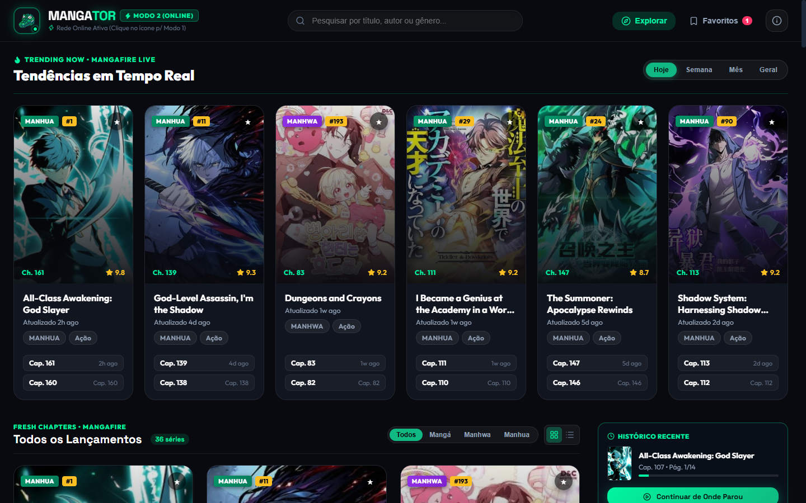
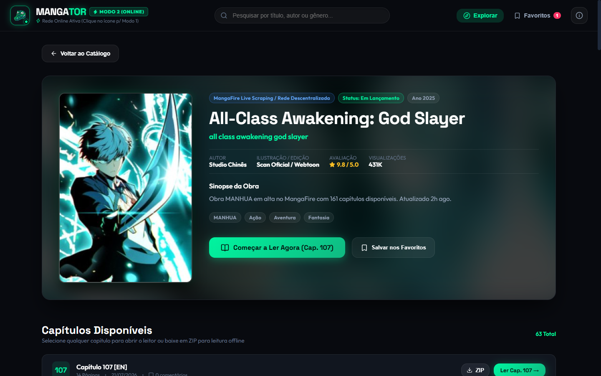
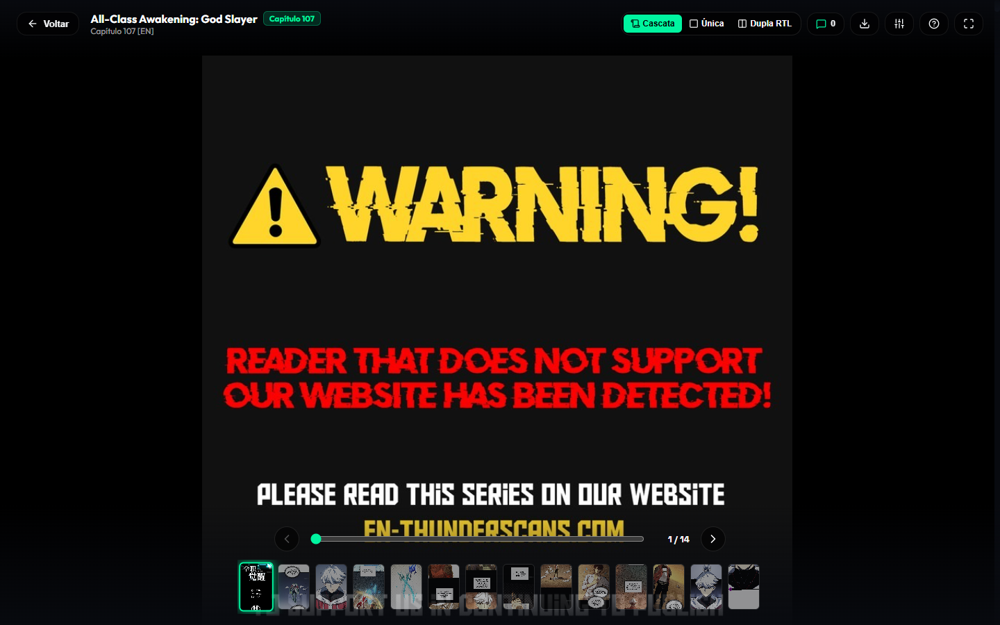
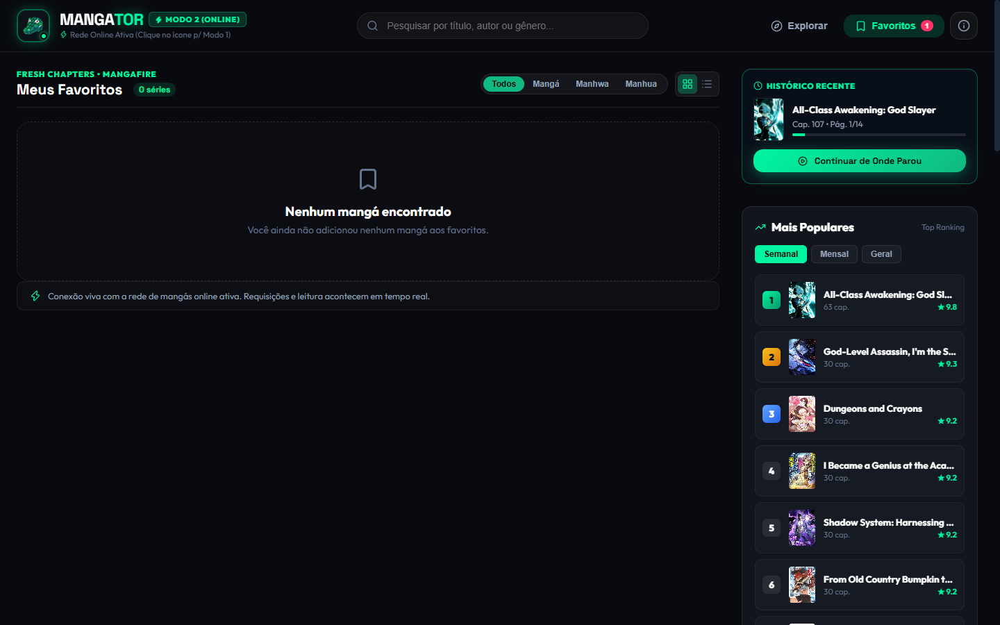
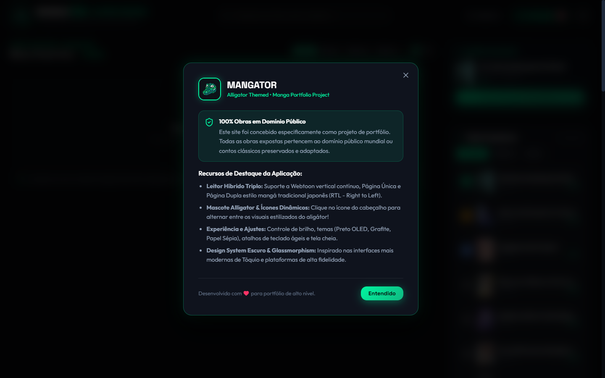

# 🐊 MANGATOR — Modern Web Manga Reader & Platform

<div align="center">



[](https://mangator.vercel.app)
[](https://react.dev/)
[](https://www.typescriptlang.org/)
[](https://vitejs.dev/)
[](LICENSE)

**Plataforma de alta performance para leitura e catalogação de mangás com design obsidian neon, leitor em cascata contínua, histórico persistente e integração de acervo online em tempo real.**

[✨ Acessar Demonstração Online](https://mangator.vercel.app) • [📖 Funcionalidades](#-funcionalidades-principais) • [🏗️ Arquitetura](#%EF%B8%8F-arquitetura-e-tecnologias) • [🚀 Como Executar](#-instalação-e-execução-local)

</div>

---

## 🌟 Destaques do Projeto

- ⚡ **Leitor em Cascata (Webtoon / Vertical Scroll)**: Leitura infinita fluida de páginas em alta resolução, com alternância para modo página única, atalhos de teclado (`←` / `→` / `Espaço`), controles de zoom e ajuste de brilho noturno.
- 🐊 **Dois Modos de Operação Integrados (Persistentes via LocalStorage)**:
  - **Modo 1 (Acervo Histórico & Domínio Público)**: Clássicos e tesouros da literatura ilustrada e quadrinhos originais (Hokusai Manga, Tagosaku to Mokube, Dracula, Carmilla, Lovecraft) com scans reais e downloads offline em `.CBZ` / `.ZIP`.
  - **Modo 2 (Rede Online em Tempo Real)**: Integração com proxy serverless de alta disponibilidade que realiza scrapping e sincronização dinâmica de milhares de mangás populares, capítulos atualizados e servidores CDN de imagens.
- 🎨 **Design System Obsidian & Neon Emerald**: Visual moderno em tons escuros profundos (`#0A0D14`), detalhes com blur de vidro (`backdrop-filter`), acentos em verde esmeralda neon (`#00F5A0`) e micro-interações fluidas.
- 📑 **Sistema de Favoritos & Marcadores**: Salve títulos favoritos e preserve seu progresso exato de leitura entre sessões.
- 🔍 **Busca Dinâmica & Filtros por Gênero**: Pesquisa instantânea em tempo real com filtros por demografia e tipo (Mangá, Manhwa, Manhua, Shounen, Seinen, etc.).
- 🛡️ **Totalmente Responsivo**: Experiência consistente adaptada para celulares, tablets e monitores ultrawide.

---

## 📸 Demonstração Visual

<div align="center">

### 1. Catálogo & Exploração
*Visualização rica em cards e lista, filtros por formato e ranking em tempo real*


---

### 2. Visão Detalhada da Obra
*Sinopse completa, badges de gêneros, métricas e lista de capítulos com sincronização dinâmica*


---

### 3. Leitor Imersivo em Cascata
*Modo contínuo sem travamentos, barra flutuante de progresso, seletor de capítulos e ajuste de visualização*


---

### 4. Meus Favoritos & Coleção
*Painel de mangás salvos localmente com estatísticas e acesso rápido*


---

### 5. Sobre o Projeto & Transparência
*Modal com informações técnicas, diretrizes de preservação e créditos*


</div>

---

## 🏗️ Arquitetura e Tecnologias

```
mangator/
├── api/                       # Vercel Serverless Functions (CORS & Scraper Proxies)
│   ├── chapter-pages.ts       # Decodificação de imagens de capítulos
│   ├── chapters.ts            # Sincronização de volumes e capítulos
│   ├── mangafire.ts           # Descoberta, busca e paginação de mangás
│   └── proxy.ts               # Proxy de streaming e bypass de imagens
├── docs/                      # Documentação e capturas de tela
│   └── screenshots/
├── public/                    # Favicon, mascote e ícones da aplicação
└── src/
    ├── components/            # Componentes modulares reutilizáveis
    │   ├── AboutModal.tsx     # Modal de informações e manifesto
    │   ├── MangaCard.tsx      # Cards interativos (Grid & Row View)
    │   ├── MangaDetail.tsx    # Visão detalhada de volumes e metadados
    │   ├── MangaReader.tsx    # Leitor em cascata contínua & página única
    │   ├── Navbar.tsx         # Cabeçalho responsivo e toggle de Modos
    │   └── PopularToday.tsx   # Ranking lateral e obras em destaque
    ├── data/                  # Estruturas de tipos e acervo histórico curado
    │   └── mangaData.ts
    ├── services/              # Camada de comunicação com a API e Scrapers
    │   └── onlineMangaService.ts
    ├── App.tsx                # Gerenciamento de estado global e roteamento
    ├── index.css              # Tokens do Design System e variáveis CSS
    └── main.tsx               # Ponto de entrada React 19
```

### Tecnologias Utilizadas

- **Frontend**: [React 19](https://react.dev/), [TypeScript 6](https://www.typescriptlang.org/), [Vite 8](https://vitejs.dev/)
- **Ícones & Efeitos**: [Lucide React](https://lucide.dev/), [Canvas Confetti](https://www.npmjs.com/package/canvas-confetti)
- **Compactação & Exportação**: [JSZip](https://stuk.github.io/jszip/) (Geração de pacotes `.CBZ`)
- **Deploy & Serverless**: [Vercel](https://vercel.com/) com Vercel Edge Functions para streaming de dados
- **Linter & Otimização**: [Oxlint](https://oxc.rs/)

---

## 🚀 Instalação e Execução Local

### Pré-requisitos

- **Node.js** (v18 ou superior recomendado)
- Gerenciador de pacotes **npm**, **pnpm** ou **yarn**

### Passo a Passo

1. **Clone o repositório:**
   ```bash
   git clone https://github.com/ryuclover/mangator.git
   cd mangator
   ```

2. **Instale as dependências:**
   ```bash
   npm install
   ```

3. **Inicie o servidor de desenvolvimento:**
   ```bash
   npm run dev
   ```

4. **Acesse no navegador:**
   ```
   http://localhost:5173
   ```

### Scripts Disponíveis

| Comando | Descrição |
|---|---|
| `npm run dev` | Inicia o servidor local do Vite com HMR |
| `npm run build` | Compila o projeto com validação estrita do TypeScript |
| `npm run preview` | Executa localmente o bundle de produção gerado |
| `npm run lint` | Executa o linter ultra-rápido Oxlint |

---

## ⚙️ Modos de Leitura

| Funcionalidade | Modo Cascata (Padrão) | Modo Página Única |
|---|---|---|
| **Experiência** | Rolagem contínua vertical ideal para Webtoons e leitura rápida | Foco página por página ideal para mangás tradicionais |
| **Navegação** | Rolagem natural do mouse / touch | Teclas `←` / `→` ou cliques laterais |
| **Carregamento** | Pré-carregamento dinâmico inteligente | Lazy loading da página ativa |

---

## 📄 Licença

Este projeto é disponibilizado sob a licença **MIT**. Consulte o arquivo [LICENSE](LICENSE) para obter detalhes.

---

<div align="center">
Desenvolvido com carinho para amantes de mangás e preservação da literatura visual.
</div>
